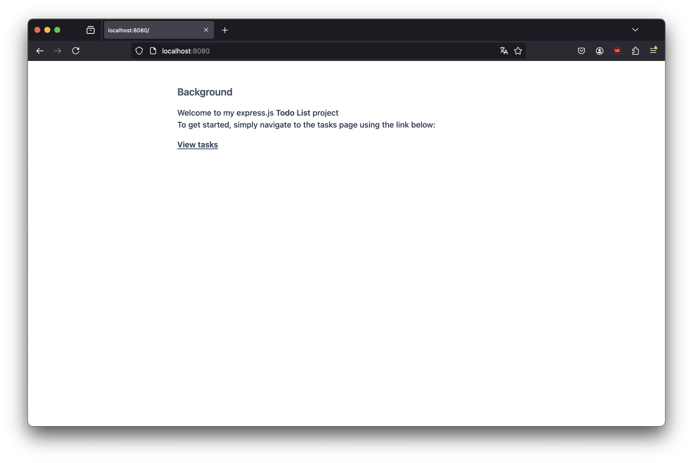
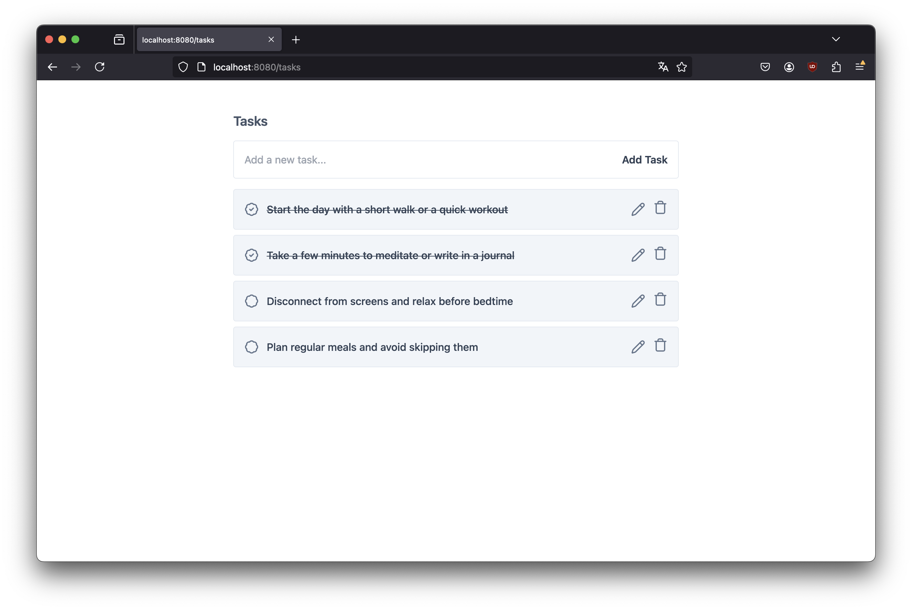
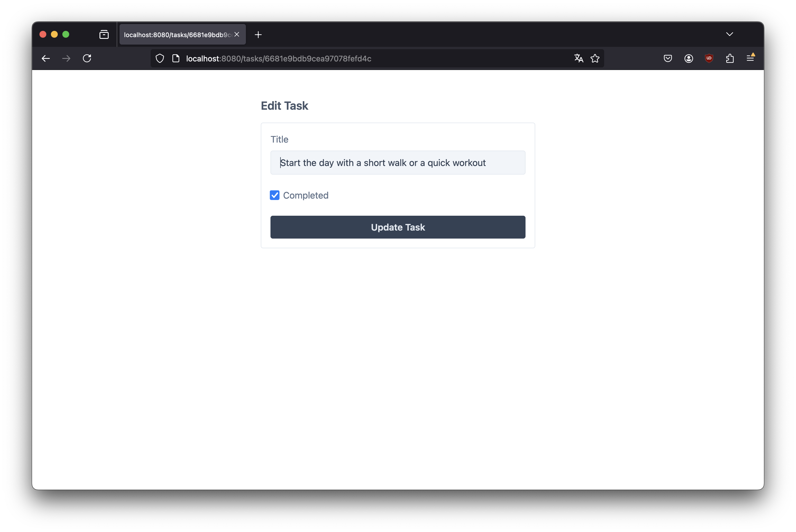

# Organizr

This project is an `express.js` app for creating tasks or todo list. The main instructions are as follows but they are written in french.

> Instructions
> Vous devez utiliser Express pour créer un serveur d'API Rest et son client.
> Ce serveur doit permettre la création et la gestion d'une todolist.
> CONTRAINTES:
>
> - Organisez votre projet en plusieurs modules
> - Optez pour une arborescence cohérente
> - Optez pour le moteur de template de votre choix pour la générations des vues
> - Utiliser MongoDB comme BDD (docker, cloud, local... comme vous voulez)
> - Il faut que le site contienne au minimum 3 pages (accueil, liste des tâches, et gestion d'une tâche)

## Screenshots





## Project Structure

```sh
.
├── packages
│   └── logger
│       ├── index.d.ts
│       ├── index.js
│       └── package.json
├── src
│   ├── controllers
│   │   └── task-controller.ts
│   ├── database
│   │   ├── models
│   │   │   └── task-model.ts
│   │   └── config.ts
│   ├── public
│   ├── routes
│   │   ├── task-routes.ts
│   │   └── views-routes.ts
│   ├── services
│   │   └── task-service.ts
│   ├── views
│   │   ├── layouts
│   │   │   └── index.hbs
│   │   ├── home.hbs
│   │   ├── task.hbs
│   │   └── tasks.hbs
│   └── app.ts
├── LICENSE
├── README.md
├── errors.log
├── nodemon.json
├── package-lock.json
├── package.json
├── server.log
└── tsconfig.json
```

## Features

- View, Add, update, and delete tasks

## Prerequisites

- Node.js
- MongoDB

## Installation

1. Clone the repository:

    ```bash
    git clone https://github.com/ericafenyo/digi-express.git
    ```

2. Navigate to the project directory:

    ```bash
    cd digi-express
    ```

3. Install the dependencies:

    ```bash
    npm install
    ```

4. Start your local MongoDB server and copy content from `.env.sample` to `.env` file

5. Start the application:

    ```bash
    # For development
    npm run dev
    ```

> For production: `npm run build && npm start`

6. Open your browser and navigate to `http://localhost:8080/` to see the application running.

## Routes

- `/`: The home page of the application
- `/tasks`: View all tasks
- `/task/:id`: Edit a task
